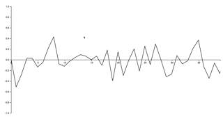

# Playing around with D3.js

click on a country it will download dummy csv data 
load_country_csv, based on Django

 

draggable rotative world map with terrorist attacks from 1970 to 2015 
sorry, next time I'll choose funnier data

 

dynamic time series chart 
ramdom generated data

